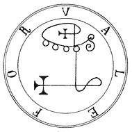

<h1  align="center">
Valefor
</h1>
<h2 align="center">
Cookiecutter Template for Flask-backend
</h2>

# Composition template

1. Flask (web-framework)
2. Flask-SQLAlchemy + Flask-Migrate (database)
3. Flask-JWT (auth)
4. Sitri (config)
5. Healthcheck (status check)
